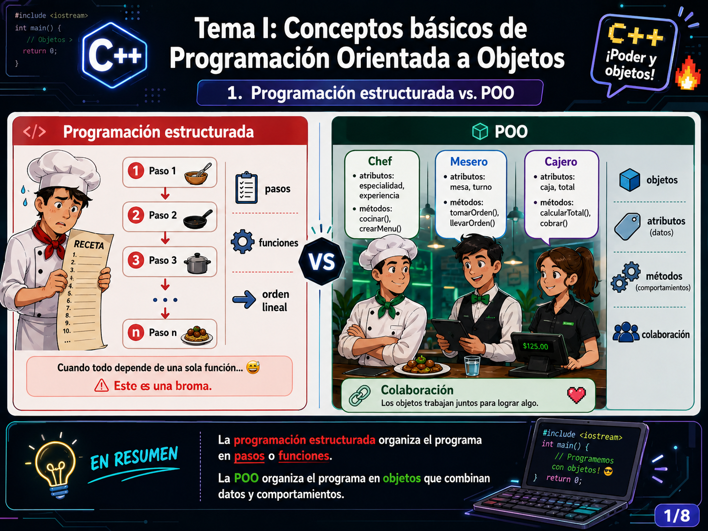
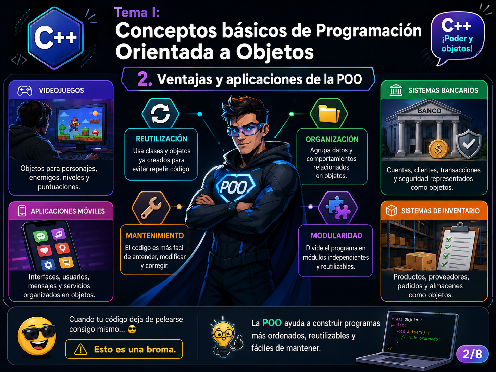
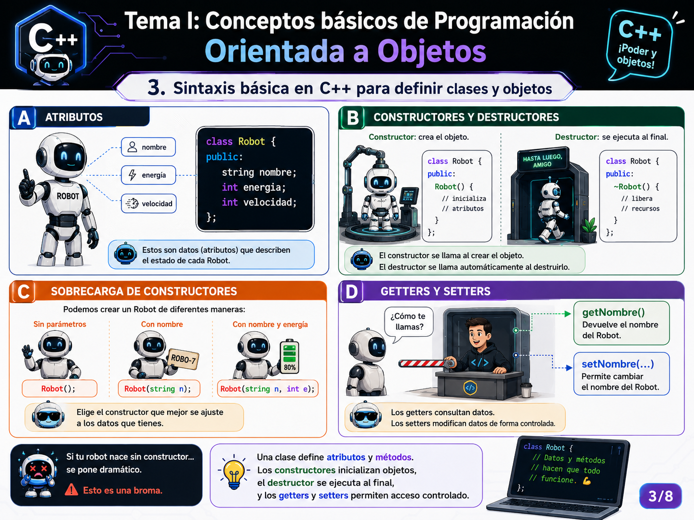
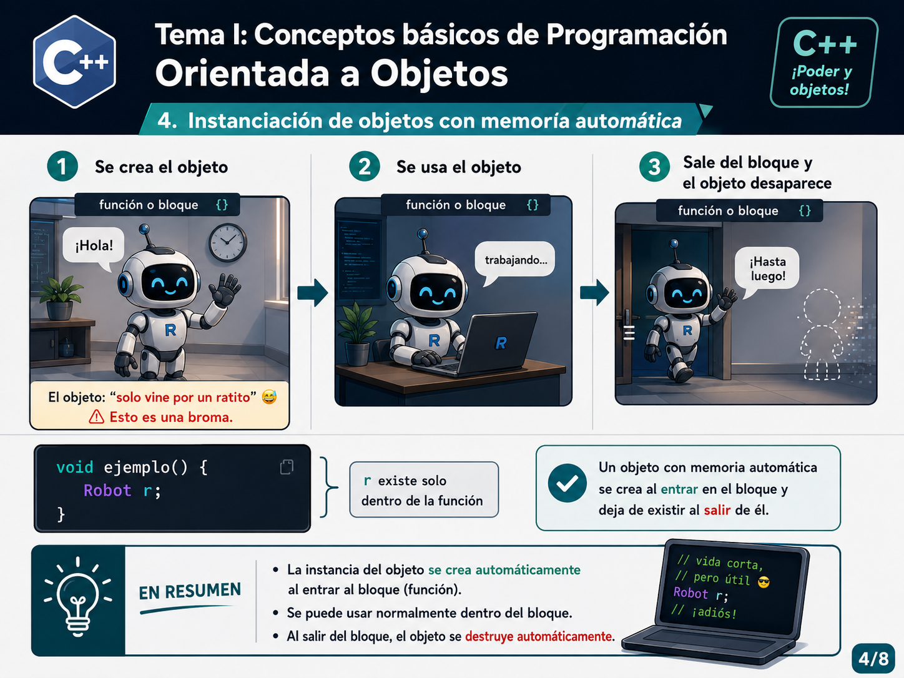
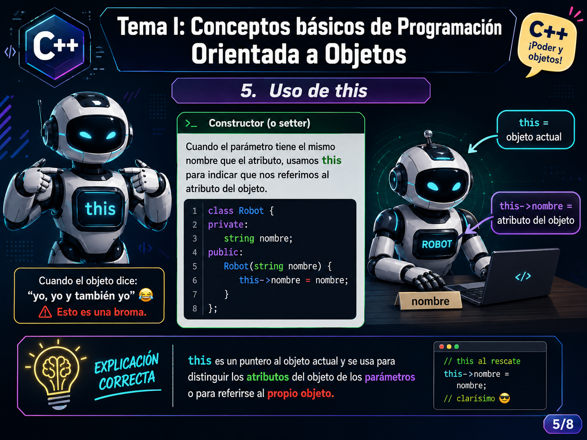
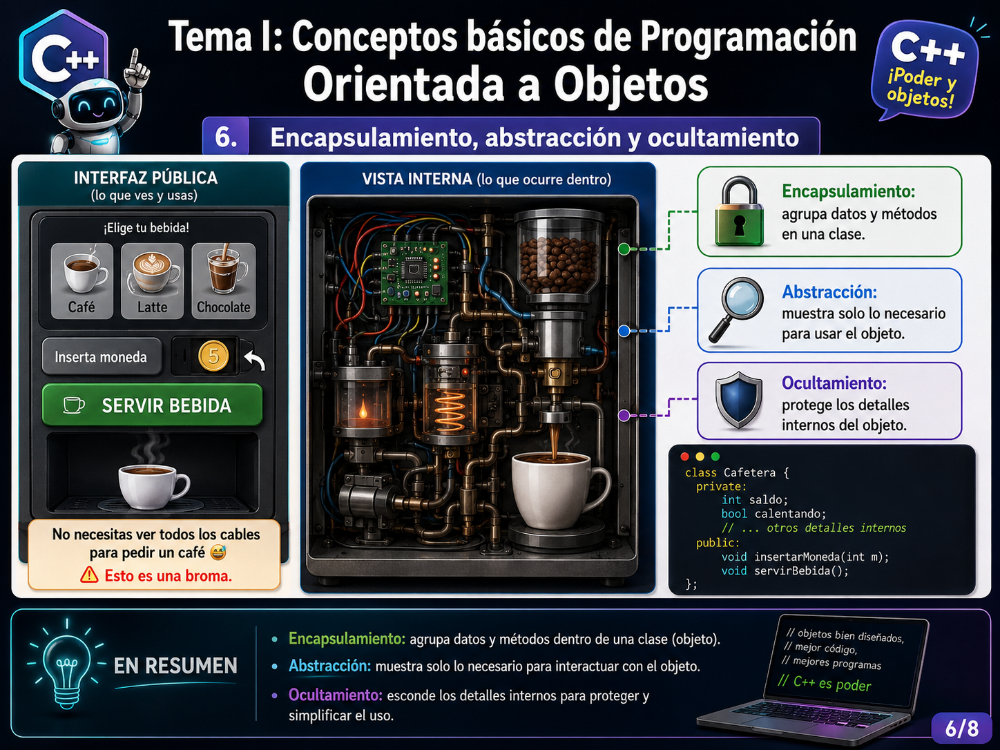
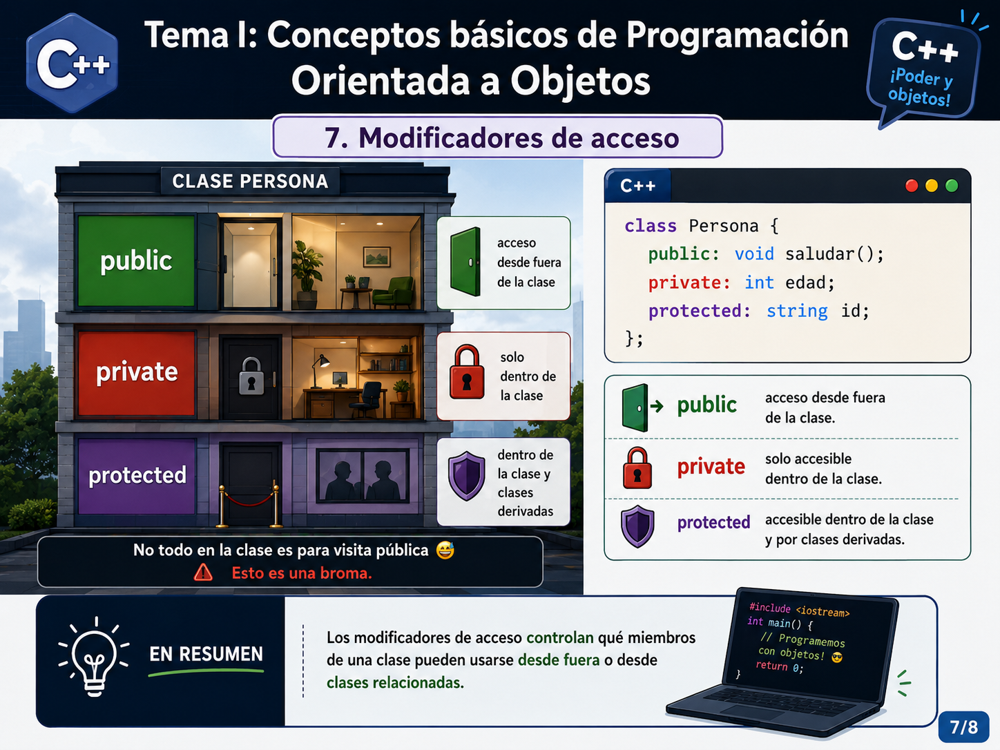
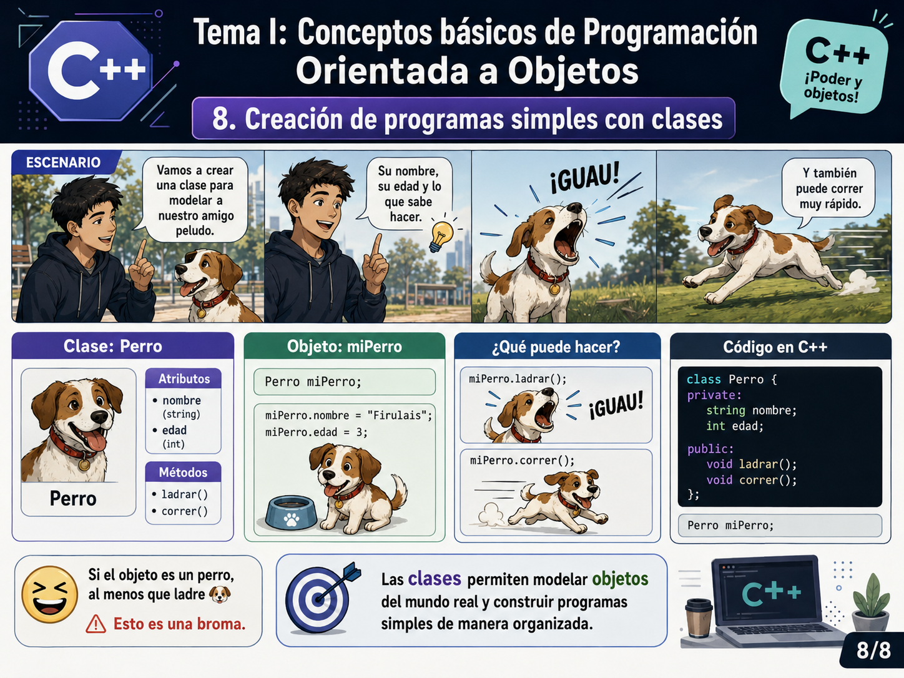

# Tema I. Conceptos básicos de Programación Orientada a Objetos


## Propósito del tema

Introducir los fundamentos de la Programación Orientada a Objetos (POO) y relacionarlos con su implementación básica en C++. Al finalizar estas primeras lecciones, el estudiantado podrá diferenciar la programación estructurada de la POO, definir clases sencillas, crear objetos y aplicar mecanismos básicos de encapsulamiento.

## Resultados de aprendizaje

Al finalizar el tema, el estudiantado será capaz de:

1. Diferenciar la programación estructurada de la Programación Orientada a Objetos.
2. Explicar las ventajas y aplicaciones básicas de la POO.
3. Definir clases con atributos, constructores, destructor y métodos.
4. Instanciar objetos con memoria automática.
5. Utilizar `this` para referirse al objeto actual.
6. Explicar el encapsulamiento, la abstracción y el ocultamiento.
7. Aplicar los modificadores de acceso `public`, `private` y `protected`.
8. Construir programas sencillos utilizando clases y objetos.

---

# Lección 1. Introducción a la Programación Orientada a Objetos

## Contenidos

- Diferencias entre programación estructurada y POO.
- Ventajas de la POO.
- Aplicaciones de la POO.
- Conceptos de clase, objeto, atributo y método.

## 1. Programación estructurada y POO



### Programación estructurada

La programación estructurada organiza la solución mediante instrucciones, decisiones, ciclos y funciones. El programa suele desarrollarse como una secuencia de pasos que transforman datos.

### Programación Orientada a Objetos

La POO organiza el programa mediante objetos. Cada objeto puede reunir:

- **Atributos:** datos que describen su estado.
- **Métodos:** acciones o comportamientos que puede realizar.
- **Responsabilidades:** tareas que le corresponden dentro del sistema.

### Comparación inicial

| Programación estructurada | Programación Orientada a Objetos |
|---|---|
| Se centra en procedimientos y funciones. | Se centra en clases y objetos. |
| Los datos y las funciones pueden encontrarse separados. | Los datos y métodos relacionados se agrupan en clases. |
| Resulta adecuada para problemas pequeños o secuenciales. | Facilita la organización de sistemas con varias entidades relacionadas. |
| El flujo del programa ocupa un papel central. | La colaboración entre objetos ocupa un papel central. |

> **Nota sobre el humor:** Las frases identificadas con **“Esto es una broma”** se utilizan para llamar la atención. La explicación académica correcta aparece en el resumen de cada imagen y en el texto de la lección.

### Preguntas para discutir

1. ¿Qué datos tendría un objeto que represente a un estudiante?
2. ¿Qué acciones podría realizar ese objeto?
3. ¿Qué objetos podrían colaborar dentro de un sistema de matrícula?

---

## 2. Ventajas y aplicaciones de la POO



### Ventajas principales

- **Reutilización:** una clase puede utilizarse para crear múltiples objetos y servir como base para nuevas soluciones.
- **Organización:** los datos y comportamientos relacionados se mantienen en una misma unidad.
- **Mantenimiento:** los cambios pueden localizarse con mayor facilidad cuando las responsabilidades están bien distribuidas.
- **Modularidad:** el programa puede dividirse en componentes con responsabilidades específicas.

### Ejemplos de aplicación

La POO puede utilizarse para representar elementos de diferentes sistemas:

| Sistema | Posibles objetos |
|---|---|
| Videojuego | jugador, enemigo, escenario, arma, puntaje |
| Aplicación móvil | usuario, mensaje, ubicación, notificación |
| Sistema bancario | cliente, cuenta, transacción, tarjeta |
| Inventario | producto, proveedor, pedido, almacén |

### Actividad breve: encontrar objetos

Seleccione uno de los siguientes contextos:

- biblioteca;
- hospital;
- tienda virtual;
- universidad;
- videojuego.

Identifique al menos **cuatro objetos**. Para cada objeto, escriba:

1. dos atributos;
2. dos métodos;
3. una responsabilidad dentro del sistema.

---

## Cierre de la lección 1

Una **clase** es una definición o modelo. Un **objeto** es una instancia concreta creada a partir de esa clase. La POO permite organizar un sistema como un conjunto de objetos que mantienen información y colaboran mediante métodos.

---

# Lección 2. Definición de clases y creación de objetos en C++

## Contenidos

- Sintaxis básica de una clase.
- Atributos.
- Constructores y destructor.
- Sobrecarga de constructores.
- Getters y setters.
- Objetos con memoria automática.
- Uso de `this`.

## 3. Sintaxis básica para definir clases y objetos



### Estructura inicial de una clase

```cpp
#include <iostream>
#include <string>

class Robot {
private:
    std::string nombre;
    int energia;
    int velocidad;

public:
    Robot()
        : nombre("Sin nombre"), energia(100), velocidad(0) {
    }

    Robot(const std::string& nombreInicial, int energiaInicial)
        : nombre(nombreInicial), energia(energiaInicial), velocidad(0) {
    }

    ~Robot() = default;

    const std::string& getNombre() const {
        return nombre;
    }

    int getEnergia() const {
        return energia;
    }

    void setNombre(const std::string& nuevoNombre) {
        nombre = nuevoNombre;
    }

    void setEnergia(int nuevaEnergia) {
        if (nuevaEnergia >= 0 && nuevaEnergia <= 100) {
            energia = nuevaEnergia;
        }
    }

    void saludar() const {
        std::cout << "Hola, soy " << nombre << ".\n";
    }
};
```

### Atributos

Los atributos almacenan el estado de un objeto. En la clase anterior:

- `nombre` identifica al robot;
- `energia` representa su nivel de energía;
- `velocidad` representa su velocidad actual.

### Constructor

Un constructor se ejecuta automáticamente al crear un objeto. Su nombre debe coincidir con el nombre de la clase y no posee tipo de retorno.

```cpp
Robot()
    : nombre("Sin nombre"), energia(100), velocidad(0) {
}
```

La lista de inicialización aparece después de los dos puntos y permite inicializar los atributos antes de ejecutar el cuerpo del constructor.

### Sobrecarga de constructores

Una clase puede poseer varios constructores, siempre que sus listas de parámetros sean diferentes.

```cpp
Robot();
Robot(const std::string& nombreInicial, int energiaInicial);
```

### Destructor

El destructor se ejecuta cuando el objeto deja de existir. Su nombre corresponde al nombre de la clase precedido por `~`.

```cpp
~Robot() = default;
```

En este ejemplo no se requiere una liberación manual de recursos, por lo que se utiliza la implementación predeterminada.

### Getters y setters

Los getters permiten consultar el estado del objeto y los setters permiten modificarlo de manera controlada.

```cpp
int getEnergia() const {
    return energia;
}

void setEnergia(int nuevaEnergia) {
    if (nuevaEnergia >= 0 && nuevaEnergia <= 100) {
        energia = nuevaEnergia;
    }
}
```

El modificador `const` al final de un método indica que ese método no debe modificar el estado del objeto.

---

## 4. Objetos con memoria automática



Un objeto con duración automática se crea al entrar en el bloque donde fue declarado y se destruye al salir de ese bloque.

```cpp
void ejecutarDemostracion() {
    Robot robotTemporal("R-01", 80);
    robotTemporal.saludar();
} // robotTemporal deja de existir aquí
```

### Ideas clave

1. No se utiliza `new` para crear el objeto.
2. El constructor se ejecuta al declarar el objeto.
3. El destructor se ejecuta automáticamente al finalizar el bloque.
4. Esta forma de creación reduce la necesidad de administrar memoria manualmente.

### Práctica guiada

Analice el siguiente código:

```cpp
int main() {
    Robot principal("Atlas", 95);

    {
        Robot auxiliar("Eco", 60);
        auxiliar.saludar();
    }

    principal.saludar();
    return 0;
}
```

Responda:

1. ¿Cuál objeto se destruye primero?
2. ¿En qué bloque existe `auxiliar`?
3. ¿Sigue existiendo `principal` después del bloque interno?

---

## 5. Uso de `this`



Dentro de un método no estático, `this` es un puntero al objeto actual.

```cpp
class Robot {
private:
    std::string nombre;

public:
    explicit Robot(const std::string& nombre)
        : nombre(nombre) {
    }

    void setNombre(const std::string& nombre) {
        this->nombre = nombre;
    }
};
```

En la instrucción:

```cpp
this->nombre = nombre;
```

- `this->nombre` corresponde al atributo del objeto;
- `nombre` corresponde al parámetro recibido por el método.

La lista de inicialización del constructor permite evitar la ambigüedad sin escribir `this->`:

```cpp
Robot(const std::string& nombre)
    : nombre(nombre) {
}
```

### Uso responsable de `this`

No es obligatorio escribir `this->` para acceder a todos los atributos. Se utiliza cuando mejora la claridad, cuando existe una ambigüedad de nombres o cuando se necesita devolver o pasar una referencia al objeto actual.

---

## Actividad práctica de la lección 2

Implemente una clase `CuentaJugador` con los siguientes elementos:

### Atributos privados

- `nombreUsuario` de tipo `std::string`;
- `nivel` de tipo `int`;
- `puntos` de tipo `int`.

### Constructores

1. Constructor sin parámetros.
2. Constructor que reciba el nombre del usuario.
3. Constructor que reciba nombre, nivel y puntos.

### Métodos

- getters para los tres atributos;
- setters que impidan niveles o puntos negativos;
- método `mostrarResumen()`;
- método `agregarPuntos(int cantidad)`.

### Ejemplo de uso esperado

```cpp
int main() {
    CuentaJugador jugador("Nova", 3, 1200);
    jugador.agregarPuntos(250);
    jugador.mostrarResumen();
    return 0;
}
```

---

# Lección 3. Protección y organización de una clase

## Contenidos

- Encapsulamiento.
- Abstracción.
- Ocultamiento.
- Modificadores de acceso.
- Creación de un programa sencillo con clases.

## 6. Encapsulamiento, abstracción y ocultamiento



### Encapsulamiento

Consiste en reunir los datos y los métodos relacionados dentro de una clase.

### Abstracción

Consiste en ofrecer al usuario de la clase las operaciones necesarias sin exigirle conocer todos los detalles internos de su implementación.

### Ocultamiento

Consiste en restringir el acceso directo a los detalles internos de la clase. En C++, esto se implementa principalmente mediante modificadores de acceso.

### Ejemplo

```cpp
class Cafetera {
private:
    int saldo;
    bool calentando;

public:
    Cafetera()
        : saldo(0), calentando(false) {
    }

    void insertarMoneda(int monto) {
        if (monto > 0) {
            saldo += monto;
        }
    }

    void servirBebida() {
        if (saldo >= 500) {
            calentando = true;
            std::cout << "Preparando bebida...\n";
            saldo -= 500;
            calentando = false;
        }
    }
};
```

El usuario de `Cafetera` utiliza `insertarMoneda()` y `servirBebida()`, pero no modifica directamente `saldo` ni `calentando`.

---

## 7. Modificadores de acceso



| Modificador | Acceso permitido |
|---|---|
| `public` | Desde cualquier parte donde el objeto sea accesible. |
| `private` | Únicamente desde los métodos de la propia clase y entidades autorizadas, como funciones o clases `friend`. |
| `protected` | Desde la propia clase y desde sus clases derivadas. |

### Ejemplo

```cpp
class Persona {
private:
    int edad;

protected:
    std::string identificadorInterno;

public:
    Persona(int edadInicial, const std::string& identificador)
        : edad(edadInicial), identificadorInterno(identificador) {
    }

    void saludar() const {
        std::cout << "Hola.\n";
    }

    int getEdad() const {
        return edad;
    }
};
```

### Regla inicial recomendada

Como regla básica para estas primeras lecciones:

- declare los atributos como `private`;
- exponga como `public` solamente las operaciones necesarias;
- utilice `protected` cuando se estudie herencia y exista una razón de diseño para permitir acceso a clases derivadas.

---

## 8. Creación de un programa sencillo con clases



La siguiente clase representa un perro mediante atributos privados y métodos públicos.

```cpp
#include <iostream>
#include <string>

class Perro {
private:
    std::string nombre;
    int edad;

public:
    Perro(const std::string& nombreInicial, int edadInicial)
        : nombre(nombreInicial), edad(edadInicial) {
    }

    const std::string& getNombre() const {
        return nombre;
    }

    int getEdad() const {
        return edad;
    }

    void ladrar() const {
        std::cout << nombre << ": ¡Guau!\n";
    }

    void correr() const {
        std::cout << nombre << " está corriendo.\n";
    }
};

int main() {
    Perro miPerro("Firulais", 3);

    std::cout << "Nombre: " << miPerro.getNombre() << '\n';
    std::cout << "Edad: " << miPerro.getEdad() << '\n';

    miPerro.ladrar();
    miPerro.correr();

    return 0;
}
```

> **Aclaración importante:** Si los atributos se declaran como `private`, no deben modificarse directamente con instrucciones como `miPerro.nombre = ...`. Deben inicializarse mediante el constructor o modificarse mediante métodos públicos controlados.

---

## Actividad integradora

Diseñe e implemente una clase para representar uno de los siguientes objetos:

- `Libro`;
- `Videojuego`;
- `Producto`;
- `Estudiante`;
- `Cancion`.

La clase debe incluir:

1. al menos tres atributos privados;
2. un constructor sin parámetros;
3. un constructor con parámetros;
4. getters y setters;
5. validación en al menos un setter;
6. dos métodos que representen comportamientos;
7. creación de al menos dos objetos en `main()`;
8. demostración del uso de sus métodos.

### Preguntas de reflexión

1. ¿Qué información debe permanecer privada?
2. ¿Qué acciones deben exponerse públicamente?
3. ¿Qué validaciones protegen el estado del objeto?
4. ¿Cómo ayuda la clase a organizar el programa?

---

# Resumen general del tema

- La programación estructurada organiza el programa principalmente mediante procedimientos y funciones.
- La POO organiza el programa mediante clases y objetos.
- Una clase reúne atributos y métodos relacionados.
- Un constructor inicializa un objeto y un destructor se ejecuta al finalizar su vida.
- La sobrecarga permite definir constructores con diferentes parámetros.
- Los getters y setters controlan el acceso al estado interno.
- Los objetos automáticos se destruyen al salir de su bloque.
- `this` apunta al objeto actual.
- El encapsulamiento, la abstracción y el ocultamiento ayudan a proteger y simplificar el diseño.
- Los modificadores `public`, `private` y `protected` controlan la visibilidad de los miembros.

---

## Estructura de archivos

Para que las imágenes se visualicen correctamente, conserve la siguiente estructura:

```text
Lecciones_POO_17_25/
├── Tema_1_Primeras_Lecciones_POO.md
└── imagenes/
    ├── 01_estructurada_vs_poo.png
    ├── 02_ventajas_aplicaciones_poo.png
    ├── 03_sintaxis_clases_objetos.png
    ├── 04_memoria_automatica.png
    ├── 05_uso_this.png
    ├── 06_encapsulamiento_abstraccion_ocultamiento.png
    ├── 07_modificadores_acceso.png
    └── 08_programa_simple_clases.png
```
